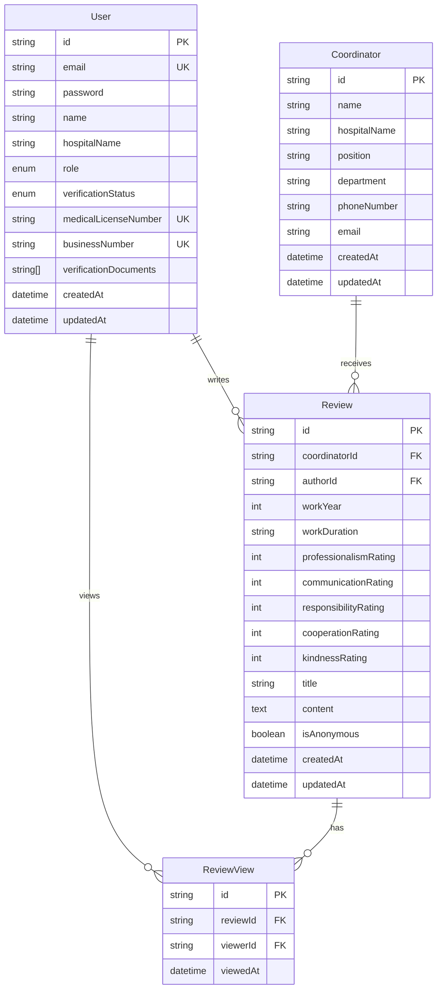

# 김실장넷 데이터베이스 스키마

## 개요

김실장넷은 PostgreSQL을 기본 데이터베이스로 사용하며, Prisma ORM을 통해 타입 안전성을 보장합니다.

## ERD (Entity Relationship Diagram)



## 테이블 상세

### 1. User (사용자)

병원 관계자 정보를 저장하는 테이블입니다.

| 컬럼명 | 타입 | 제약조건 | 설명 |
|--------|------|----------|------|
| id | String | PK | CUID 형식의 고유 식별자 |
| email | String | UNIQUE, NOT NULL | 로그인 이메일 |
| password | String | NOT NULL | bcrypt로 해시된 비밀번호 |
| name | String | NOT NULL | 사용자 실명 |
| hospitalName | String | NOT NULL | 소속 병원명 |
| role | UserRole | NOT NULL, DEFAULT 'HOSPITAL_STAFF' | 사용자 권한 |
| verificationStatus | VerificationStatus | NOT NULL, DEFAULT 'PENDING' | 인증 상태 |
| medicalLicenseNumber | String | UNIQUE | 의사면허번호 |
| businessNumber | String | UNIQUE | 사업자번호 |
| verificationDocuments | String[] | | 인증 서류 파일 경로 |
| createdAt | DateTime | DEFAULT NOW() | 가입일시 |
| updatedAt | DateTime | | 수정일시 |

**Enum 정의:**
```prisma
enum UserRole {
  ADMIN
  HOSPITAL_STAFF
}

enum VerificationStatus {
  PENDING
  VERIFIED
  REJECTED
}
```

**인덱스:**
- email (검색 최적화)
- verificationStatus (관리자 조회용)

### 2. Coordinator (상담실장/코디네이터)

평가 대상이 되는 상담실장 및 코디네이터 정보입니다.

| 컬럼명 | 타입 | 제약조건 | 설명 |
|--------|------|----------|------|
| id | String | PK | CUID 형식의 고유 식별자 |
| name | String | NOT NULL | 이름 |
| hospitalName | String | NOT NULL | 소속 병원명 |
| position | String | | 직책 (상담실장, 코디네이터 등) |
| department | String | | 담당 부서 |
| phoneNumber | String | | 연락처 |
| email | String | | 이메일 |
| createdAt | DateTime | DEFAULT NOW() | 등록일시 |
| updatedAt | DateTime | | 수정일시 |

**인덱스:**
- (name, hospitalName) 복합 인덱스 (검색 최적화)

### 3. Review (평가)

상담실장/코디네이터에 대한 평가 정보입니다.

| 컬럼명 | 타입 | 제약조건 | 설명 |
|--------|------|----------|------|
| id | String | PK | CUID 형식의 고유 식별자 |
| coordinatorId | String | FK, NOT NULL | 평가 대상 ID |
| authorId | String | FK, NOT NULL | 작성자 ID |
| workYear | Int | | 근무 연도 |
| workDuration | String | | 근무 기간 |
| professionalismRating | Int | NOT NULL | 전문성 (1-5) |
| communicationRating | Int | NOT NULL | 소통능력 (1-5) |
| responsibilityRating | Int | NOT NULL | 책임감 (1-5) |
| cooperationRating | Int | NOT NULL | 협업능력 (1-5) |
| kindnessRating | Int | NOT NULL | 친절도 (1-5) |
| title | String | NOT NULL | 평가 제목 |
| content | Text | NOT NULL | 평가 내용 |
| isAnonymous | Boolean | DEFAULT true | 익명 여부 |
| createdAt | DateTime | DEFAULT NOW() | 작성일시 |
| updatedAt | DateTime | | 수정일시 |

**인덱스:**
- coordinatorId (특정 대상 평가 조회)
- authorId (내가 쓴 평가 조회)
- createdAt (최신순 정렬)

### 4. ReviewView (평가 조회 기록)

평가 열람 권한 관리를 위한 조회 기록입니다.

| 컬럼명 | 타입 | 제약조건 | 설명 |
|--------|------|----------|------|
| id | String | PK | CUID 형식의 고유 식별자 |
| reviewId | String | FK, NOT NULL | 평가 ID |
| viewerId | String | FK, NOT NULL | 조회자 ID |
| viewedAt | DateTime | DEFAULT NOW() | 조회일시 |

**제약조건:**
- (reviewId, viewerId) UNIQUE - 중복 조회 방지

**인덱스:**
- viewerId (사용자별 조회 기록)

## 데이터 무결성 규칙

### 1. 사용자 인증
- medicalLicenseNumber와 businessNumber 중 하나는 반드시 존재
- 두 값이 모두 있을 수는 없음 (XOR 관계)

### 2. 평가 작성
- 한 사용자는 동일 코디네이터에 대해 하나의 평가만 작성 가능
- 모든 rating 필드는 1-5 범위 내

### 3. 평가 열람
- VERIFIED 상태의 사용자만 평가 열람 가능
- 평가를 작성한 사용자만 다른 평가 열람 가능

## 마이그레이션 전략

### 초기 설정
```bash
npx prisma migrate dev --name init
```

### 스키마 변경 시
1. schema.prisma 파일 수정
2. 개발 환경에서 테스트
   ```bash
   npx prisma migrate dev --name description_of_change
   ```
3. 프로덕션 배포
   ```bash
   npx prisma migrate deploy
   ```

### 롤백
```bash
# 특정 마이그레이션으로 롤백
npx prisma migrate resolve --rolled-back migration_name
```

## 성능 최적화

### 1. 인덱스 전략
- 자주 조회되는 컬럼에 인덱스 추가
- 복합 인덱스는 카디널리티가 높은 컬럼부터 배치

### 2. 쿼리 최적화
```typescript
// N+1 문제 방지 - include 사용
const reviewsWithCoordinator = await prisma.review.findMany({
  include: {
    coordinator: true,
    author: {
      select: {
        name: true,
        hospitalName: true
      }
    }
  }
})
```

### 3. 페이지네이션
```typescript
const pageSize = 20
const reviews = await prisma.review.findMany({
  skip: (page - 1) * pageSize,
  take: pageSize,
  orderBy: { createdAt: 'desc' }
})
```

## 백업 및 복구

### 백업 스크립트
```bash
#!/bin/bash
DATE=$(date +%Y%m%d_%H%M%S)
pg_dump $DATABASE_URL > backup_$DATE.sql
```

### 복구
```bash
psql $DATABASE_URL < backup_20240127_120000.sql
```

## 보안 고려사항

1. **민감 정보 암호화**
   - 비밀번호는 bcrypt로 해시
   - 의료 정보는 별도 암호화 고려

2. **접근 제어**
   - Row Level Security (RLS) 적용 가능
   - 애플리케이션 레벨에서 권한 체크

3. **SQL Injection 방지**
   - Prisma ORM 사용으로 자동 방지
   - Raw query 사용 시 파라미터 바인딩

## 모니터링

### 느린 쿼리 확인
```sql
SELECT query, calls, mean_exec_time
FROM pg_stat_statements
ORDER BY mean_exec_time DESC
LIMIT 10;
```

### 테이블 크기 확인
```sql
SELECT schemaname, tablename, 
       pg_size_pretty(pg_total_relation_size(schemaname||'.'||tablename)) AS size
FROM pg_tables
WHERE schemaname = 'public'
ORDER BY pg_total_relation_size(schemaname||'.'||tablename) DESC;
```